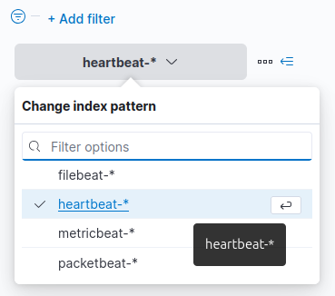
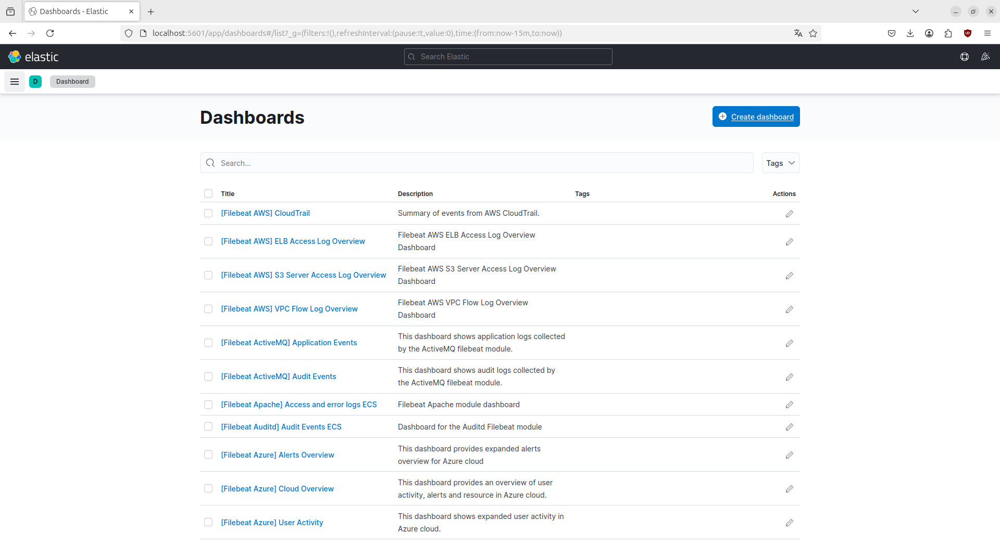

# Sommaire

## [Stack ELK (Elasticsearch, Logstash, Kibana)](#stack-elk-elasticsearch-logstash-kibana)
- [Prérequis](#prérequis)
    - [OpenJDK](#openjdk)
        - [Installation](#installation-dopenjdk)
        - [Vérification](#vérification-de-linstallation-dopenjdk)
    - [Nginx](#nginx)
        - [Installation](#installation-de-nginx)
        - [Configuration du pare-feu](#configuration-du-pare-feu)
        - [Vérification](#vérification-de-nginx)
        - [Vérification de l'adresse publique](#vérification-de-ladresse-publique)
- [Installation de la Stack ELK](#installation-de-la-stack-elk)
    - [Elasticsearch](#elasticsearch)
        - [Ajout de la clé et du dépôt](#ajout-de-la-clé-et-du-dépôt-delasticsearch)
        - [Configuration](#configuration-delasticsearch)
    - [Kibana](#kibana)
        - [Installation et démarrage](#installation-et-démarrage-de-kibana)
        - [Création d'un mot de passe crypté](#création-dun-mot-de-passe-crypté-pour-lauthentification-http)
        - [Configuration de Nginx](#configuration-de-nginx-pour-accéder-à-kibana-via-un-domaine-sécurisé)
        - [Activation du site dans Nginx](#activation-du-site-dans-nginx-avec-un-lien-symbolique)
        - [Vérification de la syntaxe](#vérification-de-la-syntaxe-de-la-nouvelle-configuration-nginx)
        - [Rechargement et gestion du pare-feu](#rechargement-et-gestion-du-pare-feu)
        - [Accès à Kibana](#accès-à-kibana)
    - [Logstash](#logstash)
        - [Installation](#installation-de-logstash)
        - [Configuration](#configuration-de-logstash-pour-recevoir-des-données)
        - [Vérification](#vérification-de-la-nouvelle-configuration-de-logstash)
    - [Beat](#beat)
        - [Filebeat](#filebeat)
            - [Installation](#installation-de-filebeat)
            - [Configuration](#configuration-de-filebeat)
            - [Activation du service](#activation-du-service-filebeat)
            - [Vérification](#vérification-de-filebeat)
        - [Metricbeat](#metricbeat)
            - [Installation](#installation-de-metricbeat)
            - [Configuration](#configuration-de-metricbeat)
            - [Activation du service](#activation-du-service-metricbeat)
            - [Vérification](#vérification-de-metricbeat)
        - [Packetbeat](#packetbeat)
            - [Installation](#installation-de-packetbeat)
            - [Configuration](#configuration-de-packetbeat)
            - [Vérification](#vérification-de-packetbeat)
        - [Heartbeat](#heartbeat)
            - [Installation](#installation-de-heartbeat)
            - [Configuration](#configuration-de-heartbeat)
            - [Vérification](#vérification-de-heartbeat)
        - [Test des Beats sous Kibana](#test-des-beats-sous-kibana)
- [Configuration pour surveiller des conteneurs Docker](#configuration-pour-surveiller-des-conteneurs-docker)
    - [Découvrir les logs](#découvrir-les-logs)
    - [Tableau de bord](#tableau-de-bord)
- [Suricata](#suricata)
    - [Installation et Activation](#installation-et-activation-de-suricata)
        - [Ajout du dépôt](#ajout-du-dépôt-logiciel-de-loisf-à-votre-système)
        - [Installation du service](#installation-du-service-suricata)
        - [Activation et redémarrage](#activation-et-redémarrage-du-service)
        - [Vérification de l'état](#vérification-de-létat-du-service)
    - [Configuration](#configuration-de-suricata)
        - [Paramètres clés](#paramètres-clés-de-configuration)
        - [Mise à jour des règles](#mise-à-jour-des-règles)
        - [Test de la configuration](#test-de-la-configuration)
    - [Journaux](#journaux-logs)
        - [Consultation des journaux](#consultation-des-journaux-de-suricata)
        - [Génération d'une alerte de test](#génération-dune-alerte-de-test-pour-vérifier-que-suricata-fonctionne)
        - [Types de journaux](#types-de-journaux)
    - [Signatures Suricata](#signatures-suricata)
        - [Actions principales](#actions-principales-pour-le-traitement-des-paquets)
        - [Format de l'en-tête des signatures](#format-de-len-tête-des-signatures)
    - [Règles Personnalisées](#règles-personnalisées---utilisation-de-testmynids)
        - [Exemples de règles](#exemples-de-règles)

# Stack ELK (Elasticsearch, Logstash, Kibana)

La stack ELK est une solution puissante pour la gestion des logs, la recherche en temps réel et la visualisation de données. Elle est couramment utilisée pour centraliser les journaux de sécurité, mais elle est également efficace pour diverses applications analytiques.

## Prérequis

### OpenJDK

La stack ELK repose sur Java, c'est pourquoi il est nécessaire d'installer OpenJDK.

1. **Installer OpenJDK**  
   On commence par installer la version par défaut d'OpenJDK, qui comprend le JRE (Java Runtime Environment) et le JDK (Java Development Kit).

   ```bash
   sudo apt install default-jre
   sudo apt install default-jdk
   ```

2. **Vérification de l'installation**  
   Pour s'assurer que l'installation d'OpenJDK a été correctement effectuée, on peut vérifier la version de `javac` :

   ```bash
   javac -version
   ```

### Nginx

Nginx est utilisé comme un reverse proxy pour sécuriser l'accès à Kibana.

1. **Installer Nginx**

   ```bash
   sudo apt install nginx
   ```

2. **Configurer le pare-feu**  
   Pour permettre le trafic HTTP, on configure `ufw` (Uncomplicated Firewall) pour autoriser Nginx.

   ```bash
   sudo ufw app list
   sudo ufw allow 'Nginx HTTP'
   sudo ufw status
   ```

3. **Vérification de Nginx**

   On s'assure ensuite que le service fonctionne correctement :

   ```bash
   systemctl status nginx
   ```

    

4. **Vérification de l'adresse publique**

    La commande `curl -4 icanhazip.com` effectue une requête vers le site web `icanhazip.com` pour récupérer votre adresse IPv4 publique. Le flag `-4` force `curl` à utiliser IPv4 au lieu de l'IPv6, garantissant ainsi que l'adresse IP retournée soit une adresse IPv4.


## Stack ELK Installation

### Elasticsearch

Elasticsearch est un moteur de recherche et d'analyse distribué, essentiel pour le stockage des données de logs. Il est nécessaire de l'installer et de le configurer pour interagir avec Kibana et Logstash.

1. **Ajouter la clé et le dépôt d'Elasticsearch**

   ```bash
   curl -fsSL https://artifacts.elastic.co/GPG-KEY-elasticsearch | sudo apt-key add -
   echo "deb https://artifacts.elastic.co/packages/7.x/apt stable main" | sudo tee -a /etc/apt/sources.list.d/elastic-7.x.list
   sudo apt update
   sudo apt install elasticsearch
   ```

2. **Configurer Elasticsearch** 

   On modifie le fichier de configuration pour définir les paramètres réseau, comme `network.host`.

   ```bash
   sudo nano /etc/elasticsearch/elasticsearch.yml
   sudo systemctl start elasticsearch
   ```

   Pour tester le service :

   ```bash
   curl -X GET "localhost:9200"
   ```

### Kibana

Kibana offre une interface utilisateur graphique permettant de visualiser et d'analyser les données stockées dans Elasticsearch.

1. **Installer et démarrer Kibana**

   ```bash
   sudo apt install kibana
   sudo systemctl enable kibana
   sudo systemctl start kibana
   ```

2. **Créer un mot de passe crypté pour l'authentification HTTP**

    ```bash
    echo "kibanaadmin:`openssl passwd -apr1`" | sudo tee -a /etc/nginx/htpasswd.users
    ```

    **`openssl passwd -apr1`** : Cette partie génère un mot de passe crypté avec l'algorithme `apr1` (utilisé pour le cryptage des mots de passe dans les fichiers `.htpasswd` pour l'authentification HTTP de base).
    
    **`echo "kibanaadmin:`openssl passwd -apr1`"`** : Crée une chaîne de texte avec le nom d'utilisateur `kibanaadmin` suivi du mot de passe crypté généré par `openssl`.

    **`| sudo tee -a /etc/nginx/htpasswd.users`** : Utilise `tee` pour ajouter (avec `-a` pour "append") cette chaîne de texte dans le fichier `/etc/nginx/htpasswd.users`, qui contient les utilisateurs et mots de passe pour l'authentification HTTP de base via Nginx.

3. **Configurer Nginx pour accéder à Kibana via un domaine sécurisé**

   Nous avons configuré Nginx comme un reverse proxy pour Kibana, offrant ainsi un accès sécurisé par mot de passe.

   ```bash
   sudo nano /etc/nginx/sites-available/cloud-computing-g3.fr
   ```


    ```nginx
    server {
        listen 80;

        server_name cloud-computing-g3.fr;

        auth_basic "Restricted Access";
        auth_basic_user_file /etc/nginx/htpasswd.users;

        location / {
            proxy_pass http://localhost:5601;
            proxy_http_version 1.1;
            proxy_set_header Upgrade $http_upgrade;
            proxy_set_header Connection 'upgrade';
            proxy_set_header Host $host;
            proxy_cache_bypass $http_upgrade;
        }
    }
    ```
    On ajoute des directives pour proxy les demandes HTTP vers Kibana et sécuriser l'accès avec une authentification de base dans le fichier.

4. **Activation du site dans Nginx avec un lien symbolique**

    ```bash
    sudo ln -s /etc/nginx/sites-available/cloud-computing-g3.fr /etc/nginx/sites-enabled/cloud-computing-g3.fr
    ```

    **`ln -s`** : Crée un lien symbolique (ou "symlink") entre deux fichiers ou répertoires. Cela permet de faire en sorte qu'un fichier ou répertoire apparaisse à un autre emplacement sans dupliquer les données.

    **`/etc/nginx/sites-available/cloud-computing-g3.fr`** : C'est le fichier de configuration de Nginx qui contient les paramètres pour le serveur associé au domaine `cloud-computing-g3.fr`. Ce fichier est situé dans le répertoire `sites-available`, qui est un emplacement où sont stockées toutes les configurations possibles des sites pour Nginx.

    **`/etc/nginx/sites-enabled/cloud-computing-g3.fr`** : C'est un lien symbolique qui pointe vers le fichier de configuration dans `sites-available`. Les fichiers dans `sites-enabled` sont ceux que Nginx utilise activement.

5. **Vérifier la syntaxe de la nouvelle configuration Nginx**

    ```bash
    sudo nginx -t
    ```

    

6. **Recharger Nginx et gérer le pare-feu**

    ```bash
    sudo systemctl reload nginx

    sudo ufw allow 'Nginx Full'

    sudo ufw delete allow 'Nginx HTTP'
    ```


7. **Accéder à Kibana**

   Après avoir configuré Nginx, on peut accéder à Kibana via l'URL définie dans le fichier de configuration (ici http://cloud-computing-g3.fr/status ou http://localhost:5601).


    

### Logstash

Logstash est l'outil de traitement de données de la stack ELK, qui permet d'injecter des données dans Elasticsearch.

1. **Installation de Logstash**

   ```bash
   sudo apt install logstash
   ```

2. **Configuration de Logstash pour recevoir des données**

   Logstash doit être configuré pour recevoir des logs de type Beats, qui sont envoyés par Suricata ou d'autres systèmes IDS/IPS.

   Le fichier de configuration contient les instructions pour recevoir ces logs et les transmettre à Elasticsearch.

   
    ```bash
    sudo touch /etc/logstash/conf.d/02-beats-input.conf
    sudo vim /etc/logstash/conf.d/02-beats-input.conf
    ```

    ```nginx
    input {
        beats {
            port => 5044
        }
    }
    ```

    ```bash
    sudo touch /etc/logstash/conf.d/30-elasticsearch-output.conf
    sudo vim /etc/logstash/conf.d/30-elasticsearch-output.conf
    ```

    ```nginx
    output {
        if [@metadata][pipeline] {
            elasticsearch {
                hosts => ["localhost:9200"]
                manage_template => false
                index => "%{[@metadata][beat]}-%{[@metadata][version]}-%{+YYYY.MM.dd}"
                pipeline => "%{[@metadata][pipeline]}"
            }
        } else {
            elasticsearch {
                hosts => ["localhost:9200"]
                manage_template => false
                index => "%{[@metadata][beat]}-%{[@metadata][version]}-%{+YYYY.MM.dd}"
            }
        }
    }
    ```

3. **Vérification de la nouvelle configuration de logstash**

    ```bash
    sudo -u logstash /usr/share/logstash/bin/logstash --path.settings /etc/logstash -t
    ```

    - `sudo -u logstash` : Cette partie de la commande exécute la commande suivante en tant qu'utilisateur `logstash`. La commande `sudo` permet à un utilisateur autorisé d'exécuter une commande en tant que superutilisateur ou un autre utilisateur, comme spécifié par l'option `-u`.

    - `/usr/share/logstash/bin/logstash` : Il s'agit du chemin vers l'exécutable Logstash. Cela spécifie où se trouve le binaire Logstash sur le système.

    - `--path.settings /etc/logstash` : Cette option spécifie le chemin vers le répertoire des paramètres pour Logstash. Le répertoire des paramètres contient généralement des fichiers de configuration que Logstash utilise pour déterminer son comportement et sa configuration.

    - `-t` : Ce drapeau indique à Logstash de s'exécuter en mode test de configuration. Il vérifie les fichiers de configuration pour les erreurs de syntaxe sans démarrer réellement le processus Logstash. Cela est utile pour valider que vos fichiers de configuration sont corrects avant d'exécuter Logstash en production.

    

4. **Activation et lancement du service logstash**

    ```bash
    sudo systemctl start logstash
    sudo systemctl enable logstash
    ```

### Beat

L’Elastic Stack utilise plusieurs expéditeurs de données légers appelés Beats pour collecter des données de diverses sources et les transporter vers Logstash ou Elasticsearch. Nous allons voir comment installer Filebeat, Metricbeat, Packetbeat et Hearbeat.

#### Filebeat
Cet expéditeur de données permet de recueillir et d'expérdier les fichiers journaux.

1. **Lancement de l'installation**

```bash
sudo apt install filebeat
```

2. **Configuration**

```bash
sudo vim /etc/filebeat/filebeat.yml
```
```bash
...
setup.kibana:

  # Kibana Host
  # Scheme and port can be left out and will be set to the default (http and 5601)
  # In case you specify and additional path, the scheme is required: http://localhost:5601/path
  # IPv6 addresses should always be defined as: https://[2001:db8::1]:5601
  host: "localhost:5601"
...
#output.elasticsearch:
# Array of hosts to connect to.
#hosts: ["localhost:9200"]
...
output.logstash:
  # The Logstash hosts
  hosts: ["localhost:5044"]
```

3. **Configuration**

Activez le module `system` sur le service filebeat.
```bash
sudo filebeat modules enable system
```
Vérifiez si le module `system` est activé.
```bash
sudo filebeat modules list
```
Configurez la redirection des journaux vers le service elasticsearch.
```bash
sudo filebeat setup --pipelines --modules system
```

```bash
sudo filebeat setup --index-management -E output.logstash.enabled=false -E
'output.elasticsearch.hosts=["localhost:9200"]'
```

```bash
sudo filebeat setup -E output.logstash.enabled=false -E
output.elasticsearch.hosts=['localhost:9200'] -E
setup.kibana.host=localhost:5601
```

4. **Activation du service**
```bash
sudo systemctl start filebeat
sudo systemctl enable filebeat
```
5. **Vérification**

Rendez-vous sur http://localhost:5601/app/management/kibana/indexPatterns/`.
L'index filebeat-* s'est créé lors du chargement de la configuration. Si ce n'est pas le cas, créez l'indexPatterns.
On peut dès à présent consulter le tableau de bord filebeat pour avoir des données sur nos fichiers journaux.


#### Metricbeat
Ce deuxième expéditeur de données collecte des métriques sur les systèmes et les services.

1. **Installation du service**

```bash
sudo apt-get install apt-transport-https
sudo apt-get install metricbeat
sudo service metricbeat start
```

2. **Configuration du service**
Commentez ou décommentez les métriques dont vous avez besoin dans `/etc/metricbeat/modules.d/system.yml`.
```bash
sudo vim /etc/metricbeat/metricbeat.yml
```
```bash
metricbeat.modules:
- module: system
  hosts: ["localhost"]
  metricsets: ["cpu", "load", "memory", "network", "process", "process.cpu"]
  period: 10s.

...

output.elasticsearch:
  hosts: ["localhost:9200"]
  username: "" #(si pas de login/mot de passe ne rien mettre)
  password: "" #(si pas de login/mot de passe ne rien mettre)

...

setup.kibana:
  host: "localhost:5601"

...

# Optionnelle
metricbeat.config.modules:
  path: ${path.config}/modules.d/*.yml
  reload.enabled: true
  reload.period: 15s
```

3. **Lancement du service**

```bash
sudo systemctl enable metricbeat
sudo service metricbeat restart
```

4. **Activation du module system** 
Pour configurer et exécuter le module system, lancez la commande suivante:

```shell
sudo metricbeat modules enable system
```

Pour voir la liste des modules activés et désactivés, exécutez :

```shell
sudo metricbeat modules list
```

5. **Chargement des tableaux de bord dans kibana**

```bash
sudo metricbeat setup -e
```

6. **Chargement du module elasticsearch-xpack**
```shell
metricbeat modules enable elasticsearch-xpack
```

7. **Vérification**

Rendez-vous sur http://localhost:5601/app/management/kibana/indexPatterns/`.
L'index metricbeat-* s'est créé lors du chargement de la configuration. Si ce n'est pas le cas, créez l'indexPatterns.
On peut dès à présent consulter le tableau de bord metricbeat pour avoir des données sur nos systèmes et services.


#### Packetbeat

Ce Beat permet de recueillir et d'analyser les données sur réseau.

1. **Installez packetbeat**

```bash
sudo apt install packetbeat -y
```

2. **Activez le lancement du service au démarrage** 

```bash
  sudo systemctl enable packetbeat
```

3. **Configuration**
Ouvrez le fichier de configuration de packetbeat.

```bash
sudo vim /etc/packetbeat/packetbeat.yml
```

Décommentez ces lignes :
```shell
...
setup.kibana:

  # Kibana Host
  # Scheme and port can be left out and will be set to the default (http and 5601)
  # In case you specify and additional path, the scheme is required: http://localhost:5601/path
  # IPv6 addresses should always be defined as: https://[2001:db8::1]:5601
  host: "localhost:5601"
...
output.elasticsearch:
  # Array of hosts to connect to.
  hosts: ["localhost:9200"]

  # Protocol - either `http` (default) or `https`.
  protocol: "http"

  # Authentication credentials - either API key or username/password.
  #api_key: "id:api_key"
  username: ""
  password: ""
...
```

Chargez la configuration de packetbeat :

```shell
sudo packetbeat setup -e
```

Si tout s'est bien passé, vous aurez en sortie :

```shell
...
2025-03-13T09:59:57.351+0100    INFO    kibana/client.go:180    Kibana url: http://localhost:5601
2025-03-13T09:59:57.519+0100    INFO    kibana/client.go:180    Kibana url: http://localhost:5601
2025-03-13T09:59:57.796+0100    INFO    [add_cloud_metadata]    add_cloud_metadata/add_cloud_metadata.go:101    add_cloud_metadata: hosting provider type not detected.
2025-03-13T10:00:10.988+0100    INFO    instance/beat.go:881    Kibana dashboards successfully loaded.
Loaded dashboards
```

4. **Vérification**
Si ce n'est pas le cas, créez l'index depuis la page comme pour metricbeat.
Rendez-vous sur `http://localhost:5601/app/management/kibana/indexPatterns/.
L'index `packetbeat-*` s'est créé lors du chargement de la configuration.
On peut dès à présent consultez le tableau de bord packetbeat pour avoir des données sur le réseau.

#### Heartbeat

Hearbeat permet de surveiller activement la disponibilité des services.

1. **Installation de Hearbeat**

```shell
sudo apt install heartbeat-elastic
```

2. **Configuration**

```shell
sudo vim /etc/heartbeat/heatbeat.yml
```

```shell
...

# Configure monitors inline
heartbeat.monitors:
- type: http
  # Set enabled to true (or delete the following line) to enable this example monitor
  enabled: false
  # ID used to uniquely identify this monitor in elasticsearch even if the config changes
  id: my-monitor
  # Human readable display name for this service in Uptime UI and elsewhere
  name: My Monitor
  # List or urls to query
  urls: ["http://localhost:9200"]
  # Configure task schedule
  schedule: '@every 5s'
  # Total test connection and data exchange timeout
  #timeout: 16s
  # Name of corresponding APM service, if Elastic APM is in use for the monitored service.
  #service.name: my-apm-service-name

...

# =================================== Kibana ===================================

# Starting with Beats version 6.0.0, the dashboards are loaded via the Kibana API.
# This requires a Kibana endpoint configuration.
setup.kibana:

  # Kibana Host
  # Scheme and port can be left out and will be set to the default (http and 5601)
  # In case you specify and additional path, the scheme is required: http://localhost:5601/path
  # IPv6 addresses should always be defined as: https://[2001:db8::1]:5601
  host: "localhost:5601"
  username: ""
  password: ""

...


# ---------------------------- Elasticsearch Output ----------------------------
output.elasticsearch:
  # Array of hosts to connect to.
  hosts: ["localhost:9200"]

  # Protocol - either `http` (default) or `https`.
  protocol: "http"

  # Authentication credentials - either API key or username/password.
  #api_key: "id:api_key"
  username: ""
  password: ""


...
```

Chargez la configuration Heartbeat :

```shell
heartbeat setup -e
```

```shell
2025-03-13T10:46:17.996+0100    INFO    template/load.go:197    Existing template will be overwritten, as overwrite is enabled.
2025-03-13T10:46:18.079+0100    INFO    template/load.go:131    Try loading template heartbeat-7.17.28 to Elasticsearch
2025-03-13T10:46:18.206+0100    INFO    template/load.go:123    Template with name "heartbeat-7.17.28" loaded.
2025-03-13T10:46:18.206+0100    INFO    [index-management]    idxmgmt/std.go:296    Loaded index template.
2025-03-13T10:46:18.415+0100    INFO    [index-management.ilm]    ilm/std.go:140    Index Alias heartbeat-7.17.28 successfully created.
Index setup finished.
```

3. **Lancement du service**

```shell
sudo systemctl start heartbeat-elastic
sudo systemctl enable heartbeat-elastic
```

4. **Vérification**
Comme précédemment, rendez-vous sur http://localhost:5601/app/management/kibana/indexPatterns/`.
L'index heartbeat-* s'est créé lors du chargement de la configuration. Si ce n'est pas le cas, créez l'indexPatterns.
On peut dès à présent consulter le tableau de bord de heartbeat pour surveiller activement la disponibilité des services.

#### Test des Beats sous Kibana

Sur la page `http://localhost:5601/app/management/kibana/indexPatterns/` il devrait y avoir un nouvel index du nom de `[beat]-*`.
Si le chargement de la configuration a échoué, vous devez créer sur cette même page ("Stack Management" > "Index Patterns") un index du nom de `metricbeat-*` (pas comme sur la capture d'écran).


Ensuite, aller sur la page Analytics > Discover puis sélectionner l'index créé.




## Configuration pour surveiller des conteneurs docker

Prise en main des outils

### Découvrir les logs

**Kibana > Discover**

Il est possible d'ajouter des filtres aux logs.

### Tableau de bord

On peut créer un tableau de bord pour visualiser une collection en temps réel.

**Kibana > Dashboard > Create dashboard**




Exemple d'un dashboard créé :

Il existe beaucoup de dashboard déjà créé.


# SURICATA

Suricata est un moteur open-source de détection des menaces réseau, capable d'effectuer la détection d'intrusions en temps réel (IDS), la prévention d'intrusions en ligne (IPS) et la surveillance de la sécurité réseau (NSM). Dans ce projet nous nous sommes amusé à installer et créer des alertes pour les différents tests disponibles sur : https://testmynids.org/

## Installation et Activation de Suricata

Ajoutez le dépôt logiciel de l'Open Information Security Foundation (OISF) à votre système :
```bash
sudo add-apt-repository ppa:oisf/suricata-stable
```

Installez le service Suricata :
```bash
sudo apt install suricata
```

Activez et redémarrez le service :
```bash
sudo systemctl restart suricata
```

Vérifiez l'état du service :
```bash
sudo systemctl status suricata.service
```

Arrêtez le service si nécessaire :
```bash
sudo systemctl stop suricata.service
```

## Configuration

Déterminez l'interface réseau par défaut :
```bash
ip -p -j route show default
```

Le fichier de configuration de Suricata est situé à :
```
/etc/suricata/suricata.yaml
```

### Paramètres Clés de Configuration
- **HOME_NET** : Définissez votre réseau interne (plages IP de votre réseau local).
- **af-packet** : Configurez l'interface réseau par défaut pour Suricata.

Pour récupérer les règles mises à jour auprès de fournisseurs externes :
```bash
sudo suricata-update
```

Pour tester la configuration en mode build :
```bash
sudo suricata -T -c /etc/suricata/suricata.yaml -v
```

### Journaux (Logs)

Consultez les journaux de Suricata :
```bash
sudo tail -f /var/log/suricata/suricata.log
```

Générez une alerte de test pour vérifier que Suricata fonctionne :
```bash
curl http://testmynids.org/uid/index.html
```

### Types de Journaux
- **Fast log :** Format de journal simple situé à `/var/log/suricata/fast.log`
- **EVE log :** Journaux au format JSON pour une analyse détaillée. Utilisez `jq` pour filtrer les journaux :
```bash
jq 'select(.alert .category=="Potentially Bad Traffic")' /var/log/suricata/eve.json
```

Installez `jq` pour une meilleure analyse des journaux :
```bash
sudo apt install jq
```

## Signatures Suricata

Suricata propose quatre actions principales pour le traitement des paquets :
- **Pass :** Arrête l'analyse des paquets et permet le trafic sans générer d'alerte.
- **Drop :** Arrête l'analyse des paquets, bloque le paquet et génère une alerte (mode IPS uniquement).
- **Reject :** Similaire à `Drop`, mais envoie un paquet de réinitialisation TCP à l'expéditeur et au destinataire.
- **Alert :** Génère une alerte sans bloquer le trafic.

### Format de l'En-tête des Signatures
```
<PROTOCOL> <SOURCE IP> <SOURCE PORT> -> <DESTINATION IP> <DESTINATION PORT>
```

## Règles Personnalisées - Utilisation de testmynids

Pour définir des règles personnalisées, mettez à jour le fichier de configuration de Suricata pour inclure vos chemins de règles (`default-rule-path` et `rule-files`).

**Exemples de Règles :**

Détecter le trafic HTTP contenant "Linux UID Test" dans l'URI :
```
alert http any any -> any any (msg:"Linux UID Test Detected"; content:"Linux UID Test"; http.uri; sid:1000001; rev:1;)
```


Détecter le trafic HTTP contenant l'en-tête "Authorization: Basic" :
```
alert http any any -> any any (msg:"Basic Authentication over Clear Text Detected"; content:"Authorization: Basic"; http.header; sid:1000002; rev:1;)
```


Détecter le trafic HTTP avec des agents utilisateurs liés à des logiciels malveillants :
```
alert http any any -> any any (msg:"Known Malware-Related User Agent Detected"; http.user_agent; content:"BlackSun"; classtype:trojan-activity; sid:1000003; rev:1;)
```


Détecter et bloquer le trafic TLS avec des certificats malveillants connus :
```
reject tls any any -> any any (msg:"Known Bad CA Certificate Detected"; tls.cert_subject; content:"edellroot.badssl.com"; classtype:policy-violation; sid:1000008; rev:1;)
```


